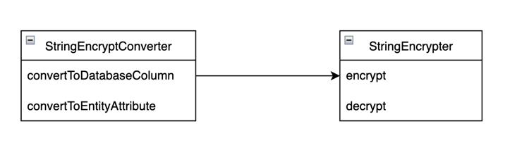
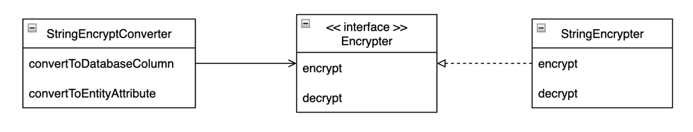

# 무신사 사전과제

입력된 고객 정보를 바탕으로 추천 상품을 가져올 때, 추천 내역을 기록하는 API 개발를 개발하는 과제입니다.
  

## **기술 스택**
- Java
- Spring Boot
- Gradle
- H2
- JPA
- Junit
- RestAssured

## 프로젝트 구조
```bash
├── main
│   ├── java
│   │   └── com
│   │       └── bgpark
│   │           └── musinsa
│   │               └── domain
│   │                   └── recommendation
│   │                       ├── application
│   │                       ├── domain
│   │                       ├── dto
│   │                       └── ui
│   └── resources
└── test
```

- **`domain`**: 도메인 모델 및 도메인 서비스가 정의되어 있는 패키지
- **`application`**: 응용 서비스를 정의한 패키지
- `**ui**` : 프레젠테이션 레이어를 정의한 패키지
- `**dto**` : 데이터 전송을 정의한 패키지
- **`test`**: 단위 테스트와 인수 테스트를 위한 패키지
  

## **실행 방법**
프로젝트를 실행하기 위해서는 다음 단계를 따라주세요.

1. 저장소를 복제합니다.

```
git clone https://github.com/your-username/musinsa-recommend.git
```

2. 프로젝트 디렉토리로 이동합니다.

```
cd musinsa
```

1. 프로젝트를 빌드하고 실행합니다.

```
./gradlew bootRun
```

  

## API 명세
상품 추천 내역을 기록합니다.

```bash
POST /musinsa/recommend
```

Request Body

```json
{
    "name": "김무신사",
    "gender": "MALE",
    "email": "kimmusinsa@musinsa.com"
}
```

- name (필수): 상품 추천하려는 고객의 이름
- gender (필수): 상품 추천하려는 고객의 성별
- email (필수): 상품 추천하려는 고객의 이메일

Response

```json
{
    "id": 1,
    "name": "김무신사",
    "email": "kimmusinsa@musinsa.com",
    "requestCount": 3,
    "createdDateTime": "2023-04-07 20:03:01",
    "updatedDateTime": "2023-04-07 20:06:56"
}
```

- id: 추천 히스토리의 고유 ID
- name : 상품 추천하려는 고객의 이름
- email : 상품 추천하려는 고객의 이메일
- requestCount : 상품 추천된 횟수
- createdDateTime : 추천 히스토리가 생성된 시각
- updatedDateTime : 추천 히스토리가 업데이트된 시각

Exception

```json
{
    "errorCode": "INVALID_METHOD_ARGUMENT",
    "exception": "MethodArgumentNotValidException",
    "invalidField": "name",
    "invalidValue": null,
    "message": "must not be blank",
    "status": "BAD_REQUEST",
    "code": 4001
}
```

- erorrCode : 에러 코드 클래스명
- exception: 발생한 예외 클래스
- invalidField : 예외가 발생한 필드명 (INVALID_METHOD_ARGUMENT에만 사용)
- invalidValue : 예외가 발생한 필드의 값 (INVALID_METHOD_ARGUMENT에만 사용)
- message : 에러 메세지
- status : 응답 상태 (HttpStatus)
- code : status를 구분하기 위한 내부 상태코드
  

## 요구사항
도메인 사전

| 한글명 | 영문명 | 설명 |
| --- | --- | --- |
| 고객 이름 | name | 추천 상품을 요청한 고객의 이름 |
| 이메일 | email | 추천 상품을 요청한 고객의 이메일 |
| 성별 | gender | 추천 상품을 요청한 고객의 성별 |
| 추천 상품 요청 횟수 | requestCount | 추천 상품을 요청한 횟수 |
| 생성 시간 | createdDateTime | 추천 상품을 최초로 요청한 시간 |
| 마지막 수정 시간 | updatedDateTime | 추천 상품을 마지막에 요청한 시간 |
- [x]  `name`은 암호화되서 저장된다
- [x]  `name`은 null이나 빈값일 수 없다
- [x]  `name`이 유효하지 않으면 예외를 반환한다
- [x]  `email`은 unique한 값이다
- [x]  `email`은 null이나 빈값일 수 없다
- [x]  `email`이 유효하지 않으면 예외를 반환한다
- [x]  `gender`는 `MALE`, `FEMALE`, `UNCHECKED` 이외 값이 요청되면 예외처리한다
- [x]  `gender`는 null이나 빈값일 수 없다
- [x]  `email`이 유효하지 않으면 예외를 반환한다
- [x]  `requestCount`는 추천 상품 요청될 때마다 1씩 증가한다
  

## 구현 방법
  

### 1. name은 암호화되서 저장된다

첫 아이디어는 엔티티 객체가 생성 시, 암호화하는 방식을 생각했습니다

```java
@Entity
public class RecommendationHistory {

		...
    private String name;

    public RecommendationHistory(String name, String email, String gender, Long requestCount)  {
        this.name = encrypt(name);
				...
    }

    public String getName() {
            return decrypt(this.name);
    }

    // 문자를 복호화
    public String decrypt(String text) {
            StringEncryptor encryptor = new StringEncryptor();
            return StringEncryptor.decode(text);
    }

		// 문자를 암호화
    public String encrypt(String text) {
				StringEncryptor encryptor = new StringEncryptor();
				return StringEncryptor.encrypt(text);
    }
}
```

```java
public class StringEncryptor {

    public String encrypt(String text)  {
				// 암호화
    }

    public String decrypt(String encrypt) {
        // 복호화
    }
}
```

이렇게 작성하면 다음과 같은 문제를 가집니다

1. 엔티티 객체가 암호화하는 책임을 가진다
  - 엔티티 객체는 테이블과 매핑되는 역할을 한다
  - 암호화/복호화하는 역할까지 책임질 필요는 없다
2. 엔티티 객체가 암호화 방식과 강한 결합을 가진다
  - encrypt 함수 내에서 StringEncryptor객체를 생성한다
  - 암호화 방식이 변경되면 엔티티 코드 또한 변경해야 한다
  - StringEncryptor는 외부에서 주입이 되지 않아
3. 암호화 코드 중복
  - 만약 암호화하는 코드를 다른 곳에서 사용한다면 코드 중복이 발생한다
  - 매번 암호화 방식이 변경될 때마다 암호화 코드를 찾아 변경해야 한다

그래서, **엔티티에서 암호화/복호화하는 코드를 분리**하는 방법을 고민하게 되었습니다

```java
@Converter
@Component
@RequiredArgsConstructor
public class StringEncryptConverter implements AttributeConverter<String, String> {

    private final StringEncryptor encryptor;

    @Override
    public String convertToDatabaseColumn(String attribute) {
        return encryptor.encrypt(attribute);
    }

    @Override
    public String convertToEntityAttribute(String dbData) {
        return encryptor.decrypt(dbData);
    }
}
```

```java
@Component
public class StringEncryptor {

    public String encrypt(String text)  {
        // 암호화
    }

    public String decrypt(String encrypt) {
        // 복호화
    }
}
```

javax.persistence 패키지의 AttributeConverter를 사용했습니다.

AttributeConverter<X, Y>는 **엔티티의 필드를 데이터베이스 컬럼**으로 혹은 반대로 변경해줍니다.

X는 엔티티 필드, Y는 데이터베이스 컬럼 타입으로 정의합니다.

아래 2개의 메소드를 오버라이드 해서 사용합니다

- convertToDatabaseColumn : 엔티티 필드를 데이터베이스 컬럼으로 변경시 인코딩,
- convertToEntityAttribute : 데이터베이스 컬럼을 엔티티 필드로 변경시 디코딩

```java
@Entity
public class RecommendationHistory {

    @Id
    private Long id;
		
    // 어노테이션 적용
    @Convert(converter = StringEncryptConverter.class)
    private String name;
    ...
}
```

다음과 같은 장점을 가집니다

- 엔티티 본연의 역할을 할 수 있다
  - 인코딩과 디코딩은 StringEncyptConverter의 역할이 된다
  - 순수하게 엔티티를 생성하고 데이터베이스에 저장하는 역할만 한다
  - 응집성 높은 코드를 작성할 수 있다
- 암호화 방식의 약한 결합을 가진다
  - 엔티티 객체는 어떤 암호화/복호화를 사용하는지 알 필요가 없다
  - 암호화/복호화 방식이 바껴도 StringEncryptConverter의 코드만 변경하면 된다
- 코드 중복 제거
  - 필요한 필드에 @Convert 어노테이션만 붙히면 된다
  - 필요하다면 Converter를 변경하면 된다




하지만 여전히 개선점할 부분이 있습니다

- StringEncryptConverter는 StringEncypt라는 구현체에 의존
  - 암호화 방식이 변경된다면 StringEncryptConverter의 코드를 수정해야 합니다
  - OCP에 위배됩니다

```java
@Converter
@Component
@RequiredArgsConstructor
public class StringEncryptConverter implements AttributeConverter<String, String> {

    private final Encrypter encryptor;

    @Override
    public String convertToDatabaseColumn(String attribute) {
        return encryptor.encrypt(attribute);
    }

    @Override
    public String convertToEntityAttribute(String dbData) {
        return encryptor.decrypt(dbData);
    }
}
```

```java
public interface Encrypter {

    String encrypt(String origin);

    String decrypt(String encrypted);
}
```

```java
@Component
public class StringEncryptor implements Encrypter { 

    @Override
    public String encrypt(String text)  {
        // 암호화
    }

    @Override
    public String decrypt(String encrypt) {
        // 복호화
    }
}
```



이제 StringEncryptConverter는 **Encrypter라는 인터페이스에 의존**하게 됩니다

- DIP 적용
  - 구현체가 아닌 인터페이스라는 추상화에 의존
  - Encrypter의 구현체가 아무리 변경되더라도 StringEncryptConverter에 영향이 없다
- OCP 적용
  - 암호화 방식을 변경하면 StringEncrypter를 수정하는 것이 아니라
  - Encrypter를 상속받는 클래스를 생성하면 암호화 방식을 변경할 수 있다
  - 코드를 수정하는 것이 아닌 확장을 통해 로직을 변경할 수 있다
  

### 2. gender는 MALE, FEMALE, UNCHECKED 이외 값이 요청되면 예외처리한다

첫 아이디어는 Controller에서 요청을 검증하는 방법을 생각했었습니다

```java
@RestController
public class RecommendationController {

    final List<String> genders = Arrays.asList("MALE", "FEMALE", "UNCHECKED");

    @PostMapping("/musinsa/recommendation")
    public ResponseEntity<RecommendationSaveResponse> save(@RequestBody RecommendationSaveRequest request) {
        if (!genders.contains(request.getGender())) {
            throw new CustomException(HttpStatus.BAD_REQUEST);
        }
    }
}
```

문제는 다음과 같은 부분이 있습니다.

- 코드 중복
  - 다른 곳에서 Gender를 검증하려면 해당 코드를 복사한다
  - 여기 저기 검증 코드가 나눠져 응집성이 떨어진다
  - 만약 성별이 추가되거나 삭제된다면 모든 Controller에서 변경해야 한다
- 컨트롤러의 역할
  - 컨트롤러가 MALE, FEMALE, UNCHECKED 등의 성별에 대해 알 필요가 없음
- 커스텀 예외
  - 매번 예외가 발생할 때마다 커스텀 코드를 작성해야 하는 불편함

위 문제를 해결하기 위해 성별 검증 로직을 분리해보았습니다.

```java
@Target(ElementType.FIELD)
@Retention(RetentionPolicy.RUNTIME)
@Constraint(validatedBy = {GenderValidator.class})
public @interface Gender {

    String message() default "must be a valid gender";

    Class[] groups() default {};

    Class[] payload() default {};
}
```

javax.validation 패키지의 ConstraintValidator로 커스텀한 검증 어노테이션을 만들 수 있습니다.

Gender라는 어노테이션을 생성하고 다음과 같은 조건을 설정합니다

- @Target : 필드를 대상
- @Retention : 런타임에 동작
- @Constraint : 검증하고자 하는 타켓의 유효성을 검증하는 클래스 적용
- message : 에러 발생 시, 기본 에러 메세지

```java
public class GenderValidator implements ConstraintValidator<Gender, String> {

    private static final List<String> genders = Arrays.asList("MALE", "FEMALE", "UNCHECKED");

    @Override
    public boolean isValid(String value, ConstraintValidatorContext context) {
        return genders.contains(value);
    }
}
```

GenderValidator가 타겟을 검증하는 클래스입니다.

ConstraintValidator<어노테이션, 타겟 타입>을 상속받아 isValid를 구현하면 됩니다

isValid가 false이면 MethodArgumentNotValidException 에러를 발생시킵니다.

```java
public class RecommendationSaveRequest {

		// 어노테이션 적용
    @Gender
    private String gender;
}
```

```java
@RestController
public class RecommendationController {

    @PostMapping("/musinsa/recommendation")
    public ResponseEntity<RecommendationSaveResponse> save(@Valid @RequestBody RecommendationSaveRequest request) {
				...
    }
}
```

성별 필드에 @Gender라는 어노테이션을 추가하고, 컨트롤러 파라미터에 @Valid 어노테이션을 추가하면 성별에 대한 검증을 할 수 있습니다.

이러한 방식은 아래와 같은 장점을 가집니다

- 높은 응집성
  - 성별을 검증할 Dto 필드에 @Gender 어노테이션만 추가
  - 성별 검증 코드가 변경되더라도 GenderValidator 코드만 변경하면 됨
- 에러처리의 일원화
  - @Valid은 @Email, @NotNull 등을 사용해도 똑같은 MethodArgumentNotValidException를 반환
  - 커스텀 예외를 매번 정의하는 대신 MethodArgumentNotValidException 하나만 처리
  

### 3. requestCount는 추천 상품 요청될 때마다 1씩 증가한다

첫 아이디어는 Service에서 추천 상품 요청을 1씩 증가했습니다

```java
@Component
@RequiredArgsConstructor
public class RecommendationHistoryService {

    @Transactional
    public RecommendationHistory save(RecommendationSaveRequest request) {
        RecommendationHistory history = recommendationHistoryRepository.findByEmail(request.getEmail())

				history.setRequestCount(history.getRequestCount + 1);
    }
}
```

위 코드는 다음과 같은 문제를 가지고 있습니다.

- 낮은 응집성
  - RecommendationHistory의 상태를 getter를 통해 외부로 노출하면 캡슐화가 깨지고 결합도가 높아진다
  - 메세지를 통해 객체 내부의 상태를 스스로 변경해야 한다
- 상태 변경의 위험성
  - setter를 사용하면 RecommendationHistory의 상태가 실수로 외부에서 변경될 수 있다
  - 비즈니스 로직에서 실수로 상태가 변경된다면 예기치 못한 결과를 얻을 수 있다.
- 비즈니스 로직의 중복
  - requestCount를 1증가시키는 로직은 비즈니스에서 중요한 로직이다
  - RecommendationHistory 도메인이 비즈니스 로직을 가지고 스스로의 상태를 변경하면 중복을 피할 수 있다

개수를 증가하는 비즈니스 로직을 도메인 객체로 옮겨보겠습니다

```java
// setter 제거
public class RecommendationHistory extends BaseTime {
		
		...
    private int requestCount;
		...

    public void increaseCount() {
        this.requestCount += 1;
    }
}
```

```java
@Component
@RequiredArgsConstructor
public class RecommendationHistoryService {

    @Transactional
    public RecommendationHistory save(RecommendationSaveRequest request) {
        RecommendationHistory history = recommendationHistoryRepository.findByEmail(request.getEmail())

				history.increaseCount();
    }
}
```

위와 같은 코드는 아래와 같은 장점을 가집니다

- 높은 응집성
  - 단순히 increaseCount라는 메세지만 외부에 노출할 채
  - requestCount가 외부에 노출되지 않고 객체 내에서 변경될 수 있다.
- 상태 보호
  - 외부에서 history가 어떤 상태를 가지고 있는지 모른다
  - 또한 setter가 없어 외부에서 내부의 상태를 변경할 수 있는 방법이 없다
- 비즈니스 로직 재사용
  - 만약 다른 곳에서 개수를 1증가 하고 싶다면 increaseCount만 호출하면 된다
  - 비즈니스 로직의 일관성도 함께 지킬 수 있다
- 가독성
  - increaseCount라는 메소드만 보고도 해당 코드가 어떤 역할을 하는지 알 수 있다
  

### 4. 암호화 방식

암호화 방식은 AES 암호화 방식을 사용했습니다

주로 사용되는 암호화 방식은 다음과 같습니다

|  | AES | RSA | Crypt |
| --- | --- | --- | --- |
| 방식 | 대칭키 암호화 | 공개키 암호화  | 해시 암호화 (SHA) |
| 특징 | 블록 암호화 방식을 사용 | 공개키로 암호화하고 개인키로 복호화 | 암호화만 가능 |
| 장점 | 빠르고 안전, 대용량 데이터에 적합 | 비대칭 암호화 방식으로 안전, 중간자 공격 등에 강함 | 빠르고 안전, 대용량 데이터에 적합, 데이터 무결성 보장 |
| 단점 | 키 관리가 중요 | 대칭키 방식에 비해 느림, 대용량 데이터에 부적합, 키 관리에 부담 | 복호화 불가, 충돌발생 가능성 |
| 용도 | 데이터베이스 및 파일 암호화 | 인증서, 전자서명 | 비밀번호 |

AES 암호화 방식이 데이터베이스의 문자를 암호화 하기 좋은 방식이기에 사용했습니다

- 장점
  - 주로 데이터베이스의 암호화에 사용되는 알고리즘
  - 빠르게 암호화 가능하여 대용량 처리에 적합하다 생각
- 단점
  - 대칭키 암호화 방식으로 암호화와 복호화를 하나의 키로 하므로 키 관리가 중요

RSA는 비대칭키 암호화 방식으로 AES 보다 안전하지만 주로 인증서나 전자서명에 사용되는 암호화 방식입니다.
Crypt 암호화 방식은 암호화는 가능하지만 복호화가 불가능하기 때문에 복호화가 가능해야 하는 이름 암호화 방식에 적절하지 않다고 생각했습니다.
  

## 테스트 방법
아래 명령어를 실행하면 단위 테스트 및 인수테스트가 실행됩니다. 인수 테스트는 실제 HTTP API를 호출하여 테스트합니다.

```bash
./gradlew test
```
